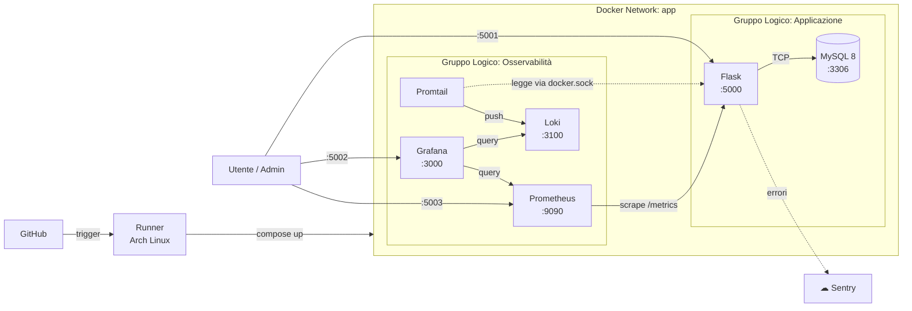
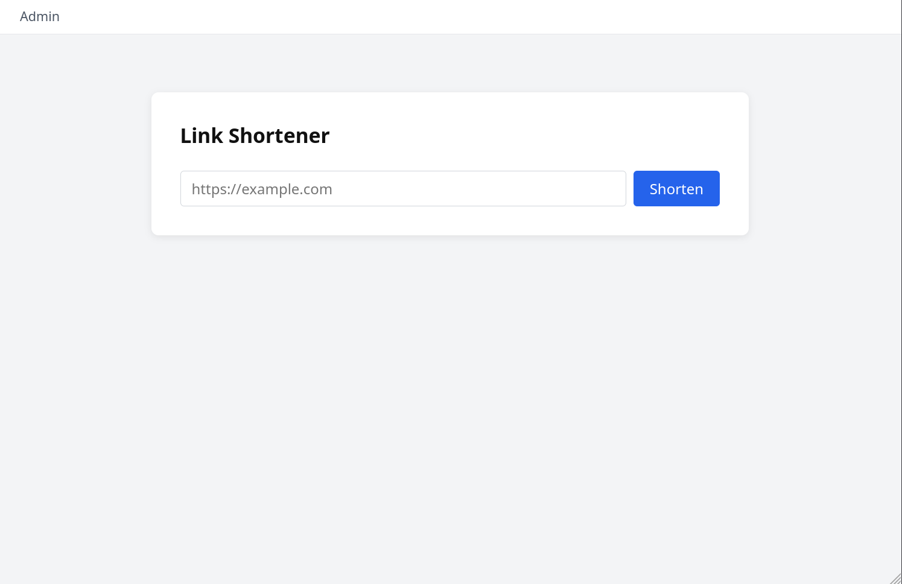
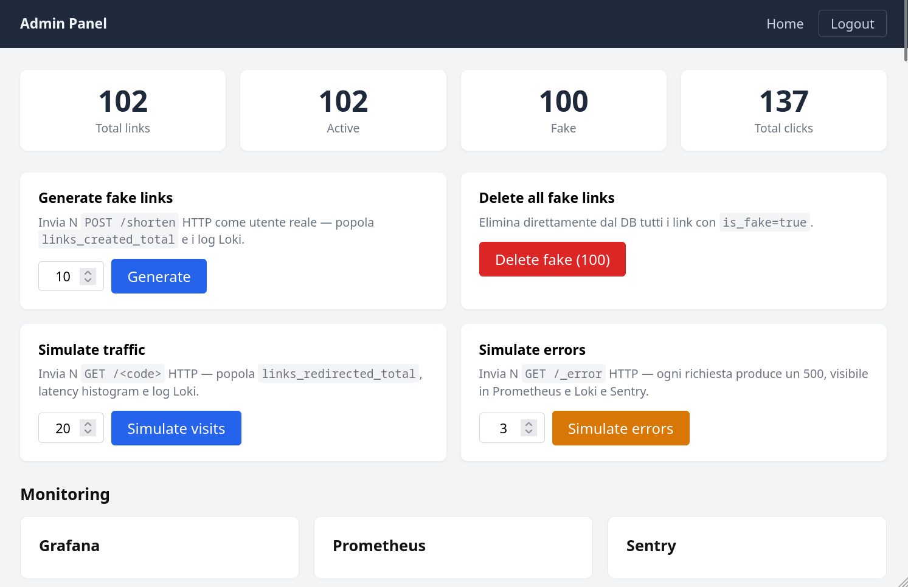
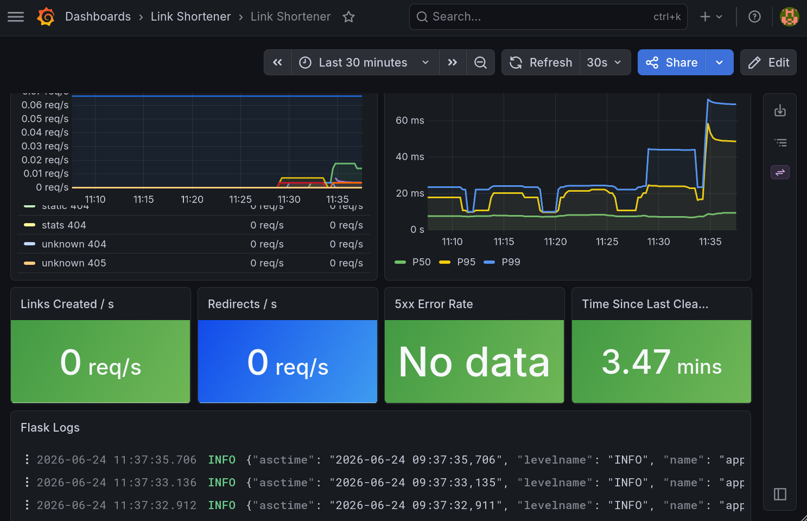

<div class="flex flex-col items-center justify-center h-full gap-6">

<div class="flex items-center gap-3 text-sm text-slate-400 font-mono tracking-widest uppercase">
  <span>UniTN</span>
  <span class="opacity-40">·</span>
  <span>Fondamenti di Amministrazione di Sistema</span>
  <span class="opacity-40">·</span>
  <span>A.A. 2025/2026</span>
</div>

<h1 class="text-6xl font-bold leading-tight !mt-2">
  <span class="text-transparent bg-clip-text bg-gradient-to-r from-sky-400 via-cyan-300 to-teal-400">
    Link Shortener
  </span>
</h1>

<p class="text-2xl text-slate-300 font-light">
  con Stack di Osservabilità
</p>

<div class="flex gap-3 mt-4 flex-wrap justify-center">
  <span class="px-3 py-1 rounded-full bg-sky-500/15 border border-sky-500/30 text-sky-300 text-sm font-mono">Flask</span>
  <span class="px-3 py-1 rounded-full bg-orange-500/15 border border-orange-500/30 text-orange-300 text-sm font-mono">MySQL</span>
  <span class="px-3 py-1 rounded-full bg-red-500/15 border border-red-500/30 text-red-300 text-sm font-mono">Prometheus</span>
  <span class="px-3 py-1 rounded-full bg-yellow-500/15 border border-yellow-500/30 text-yellow-300 text-sm font-mono">Grafana</span>
  <span class="px-3 py-1 rounded-full bg-green-500/15 border border-green-500/30 text-green-300 text-sm font-mono">Loki</span>
  <span class="px-3 py-1 rounded-full bg-purple-500/15 border border-purple-500/30 text-purple-300 text-sm font-mono">Ansible</span>
</div>

<div class="mt-8 text-slate-500 text-sm">
  Stefano Videsott<br>Ismaele De Giorgi
</div>

</div>

---
transition: fade-out
---

# Indice

<div class="grid grid-cols-2 gap-4 mt-6 text-left">

<div class="space-y-3">

<div v-click.fade.up.scale class="flex items-start gap-3 p-3 rounded-lg bg-slate-800/60 border border-slate-700">
  <span class="text-sky-400 font-mono text-sm mt-0.5 shrink-0">01</span>
  <div>
    <div class="font-semibold text-slate-200">Il Progetto</div>
    <div class="text-sm text-slate-400">Obiettivi, motivazione, funzionalità</div>
  </div>
</div>

<div v-click.fade.up.scale class="flex items-start gap-3 p-3 rounded-lg bg-slate-800/60 border border-slate-700">
  <span class="text-sky-400 font-mono text-sm mt-0.5 shrink-0">02</span>
  <div>
    <div class="font-semibold text-slate-200">Stack & Architettura</div>
    <div class="text-sm text-slate-400">Servizi Docker, networking, volumi</div>
  </div>
</div>

<div v-click.fade.up.scale class="flex items-start gap-3 p-3 rounded-lg bg-slate-800/60 border border-slate-700">
  <span class="text-sky-400 font-mono text-sm mt-0.5 shrink-0">03</span>
  <div>
    <div class="font-semibold text-slate-200">Osservabilità</div>
    <div class="text-sm text-slate-400">Prometheus, Grafana, Loki, Sentry</div>
  </div>
</div>

<div v-click.fade.up.scale class="flex items-start gap-3 p-3 rounded-lg bg-slate-800/60 border border-slate-700">
  <span class="text-sky-400 font-mono text-sm mt-0.5 shrink-0">04</span>
  <div>
    <div class="font-semibold text-slate-200">CI/CD & Deployment</div>
    <div class="text-sm text-slate-400">GitHub Actions, Ansible</div>
  </div>
</div>

</div>

<div class="space-y-3">

<div v-click.fade.up.scale class="flex items-start gap-3 p-3 rounded-lg bg-slate-800/60 border border-slate-700">
  <span class="text-teal-400 font-mono text-sm mt-0.5 shrink-0">05</span>
  <div>
    <div class="font-semibold text-slate-200">Demo Live</div>
    <div class="text-sm text-slate-400">Accorciamento link, redirect, dashboard</div>
  </div>
</div>

<div v-click.fade.up.scale class="flex items-start gap-3 p-3 rounded-lg bg-slate-800/60 border border-slate-700">
  <span class="text-teal-400 font-mono text-sm mt-0.5 shrink-0">06</span>
  <div>
    <div class="font-semibold text-slate-200">Concolusione</div>
    <div class="text-sm text-slate-400">Ringraziamento e discussione</div>
  </div>
</div>

</div>

</div>

---
layout: section
---

# 01 · Il Progetto

---

# Il Progetto

<div class="grid grid-cols-3 gap-5 mt-6">

<div v-click.fade.up.scale class="col-span-1 p-5 rounded-xl bg-gradient-to-b from-sky-500/10 to-sky-500/5 border border-sky-500/20">
  <div class="text-sky-400 mb-3">
    <svg xmlns="http://www.w3.org/2000/svg" class="w-7 h-7" fill="none" viewBox="0 0 24 24" stroke-width="1.5" stroke="currentColor"><path stroke-linecap="round" stroke-linejoin="round" d="M13.19 8.688a4.5 4.5 0 0 1 1.242 7.244l-4.5 4.5a4.5 4.5 0 0 1-6.364-6.364l1.757-1.757m13.35-.622 1.757-1.757a4.5 4.5 0 0 0-6.364-6.364l-4.5 4.5a4.5 4.5 0 0 0 1.242 7.244" /></svg>
  </div>
  <h3 class="font-semibold text-slate-200 mb-2">Link Shortener</h3>
  <p class="text-sm text-slate-400 leading-relaxed">Accorcia URL lunghi in codici brevi a 6 caratteri con TTL configurabile e pannello admin.</p>
</div>

<div v-after.fade.up.scale class="col-span-1 p-5 rounded-xl bg-gradient-to-b from-green-500/10 to-green-500/5 border border-green-500/20">
  <div class="text-green-400 mb-3">
    <svg xmlns="http://www.w3.org/2000/svg" class="w-7 h-7" fill="none" viewBox="0 0 24 24" stroke-width="1.5" stroke="currentColor"><path stroke-linecap="round" stroke-linejoin="round" d="M3.75 3v11.25A2.25 2.25 0 0 0 6 16.5h2.25M3.75 3h-1.5m1.5 0h16.5m0 0h1.5m-1.5 0v11.25A2.25 2.25 0 0 1 18 16.5h-2.25m-7.5 0h7.5m-7.5 0-1 3m8.5-3 1 3m0 0 .5 1.5m-.5-1.5h-9.5m0 0-.5 1.5m.75-9 3-3 2.148 2.148A12.061 12.061 0 0 1 16.5 7.605" /></svg>
  </div>
  <h3 class="font-semibold text-slate-200 mb-2">Stack di Osservabilità</h3>
  <p class="text-sm text-slate-400 leading-relaxed">Metriche, log strutturati e tracciamento errori.</p>
</div>

<div v-after.fade.up.scale class="col-span-1 p-5 rounded-xl bg-gradient-to-b from-purple-500/10 to-purple-500/5 border border-purple-500/20">
  <div class="text-purple-400 mb-3">
    <svg xmlns="http://www.w3.org/2000/svg" class="w-7 h-7" fill="none" viewBox="0 0 24 24" stroke-width="1.5" stroke="currentColor"><path stroke-linecap="round" stroke-linejoin="round" d="M5.25 14.25h13.5m-13.5 0a3 3 0 0 1-3-3m3 3a3 3 0 1 0 6 0m-6 0H3m16.5 0a3 3 0 0 0 3-3m-3 3a3 3 0 1 1-6 0m6 0H21m-9-3a3 3 0 1 0-6 0m6 0a3 3 0 1 1 6 0" /></svg>
  </div>
  <h3 class="font-semibold text-slate-200 mb-2">Infrastructure as Code</h3>
  <p class="text-sm text-slate-400 leading-relaxed">Deploy riproducibile su Arch Linux con Ansible. CI/CD automatico via GitHub Actions.</p>
</div>

</div>

<div v-click.fade.up.scale class="mt-6 p-4 rounded-lg bg-slate-800/50 border border-slate-700 text-left">
  <p class="text-sm text-slate-300">
    <span class="text-sky-400 font-semibold">Obiettivo del progetto:</span>
    Il focus non è l'applicazione in sé, ma l'<span class="text-teal-300">infrastruttura</span> che la circonda. Con deployment ripetibile ed automatizzato.
  </p>
</div>

---

# API & Funzionalità

<div class="grid grid-cols-2 gap-6 mt-4 text-left">

<div>

### Endpoint Principali

<div class="space-y-2 mt-3 font-mono text-sm">

<!-- <div v-click.fade.up.scale class="flex items-center gap-3 p-3 rounded-lg bg-slate-800/60 border border-slate-700">
  <span class="px-2 py-0.5 rounded bg-sky-500/20 text-sky-400 text-xs font-bold">GET</span>
  <span class="text-slate-300">/</span>
  <span class="text-slate-500 text-xs ml-auto">Home</span>
</div> -->

<div v-click.fade.up.scale class="flex items-center gap-3 p-3 rounded-lg bg-slate-800/60 border border-slate-700">
  <span class="px-2 py-0.5 rounded bg-green-500/20 text-green-400 text-xs font-bold">POST</span>
  <span class="text-slate-300">/shorten</span>
  <span class="text-slate-500 text-xs ml-auto">Crea short link</span>
</div>

<div v-after.fade.up.scale class="flex items-center gap-3 p-3 rounded-lg bg-slate-800/60 border border-slate-700">
  <span class="px-2 py-0.5 rounded bg-sky-500/20 text-sky-400 text-xs font-bold">GET</span>
  <span class="text-slate-300">/_error</span>
  <span class="text-slate-500 text-xs ml-auto">Triggers an error 500</span>
</div>

<div v-after.fade.up.scale class="flex items-center gap-3 p-3 rounded-lg bg-slate-800/60 border border-slate-700">
  <span class="px-2 py-0.5 rounded bg-sky-500/20 text-sky-400 text-xs font-bold">GET</span>
  <span class="text-slate-300">/&lt;short_code&gt;</span>
  <span class="text-slate-500 text-xs ml-auto">Redirect</span>
</div>

<div v-after.fade.up.scale class="flex items-center gap-3 p-3 rounded-lg bg-slate-800/60 border border-slate-700">
  <span class="px-2 py-0.5 rounded bg-sky-500/20 text-sky-400 text-xs font-bold">GET</span>
  <span class="text-slate-300">/stats/&lt;short_code&gt;</span>
  <span class="text-slate-500 text-xs ml-auto">Click, scadenza</span>
</div>

<div v-after.fade.up.scale class="flex items-center gap-3 p-3 rounded-lg bg-slate-800/60 border border-slate-700">
  <span class="px-2 py-0.5 rounded bg-sky-500/20 text-sky-400 text-xs font-bold">GET</span>
  <span class="text-slate-300">/health</span>
  <span class="text-slate-500 text-xs ml-auto">DB connectivity</span>
</div>

<div v-after.fade.up.scale class="flex items-center gap-3 p-3 rounded-lg bg-slate-800/60 border border-slate-700">
  <span class="px-2 py-0.5 rounded bg-sky-500/20 text-sky-400 text-xs font-bold">GET</span>
  <span class="text-slate-300">/metrics</span>
  <span class="text-slate-500 text-xs ml-auto">Prometheus</span>
</div>

</div>

</div>

<div>

### Features

<div class="space-y-2 mt-3 text-sm">

<div v-click.fade.up.scale class="flex items-start gap-2 p-3 rounded-lg bg-slate-800/40 border border-slate-700/50">
  <span class="text-green-400 mt-0.5 shrink-0">✓</span>
  <span class="text-slate-300">Short code alfanumerico (6 char, <code class="text-sky-300">62⁶ ≈ 56 miliardi</code> di combinazioni)</span>
</div>

<div v-after.fade.up.scale class="flex items-start gap-2 p-3 rounded-lg bg-slate-800/40 border border-slate-700/50">
  <span class="text-green-400 mt-0.5 shrink-0">✓</span>
  <span class="text-slate-300">Simulazione di errori dell'applicazione lato backend</span>
</div>

<div v-after.fade.up.scale class="flex items-start gap-2 p-3 rounded-lg bg-slate-800/40 border border-slate-700/50">
  <span class="text-green-400 mt-0.5 shrink-0">✓</span>
  <span class="text-slate-300">TTL (default 30 giorni) e cleanup automatico (default 10 min) configurabili</span>
</div>

<div v-after.fade.up.scale class="flex items-start gap-2 p-3 rounded-lg bg-slate-800/40 border border-slate-700/50">
  <span class="text-green-400 mt-0.5 shrink-0">✓</span>
  <span class="text-slate-300">Pannello admin per gestione e monitoraggio link</span>
</div>

<div v-after.fade.up.scale class="flex items-start gap-2 p-3 rounded-lg bg-slate-800/40 border border-slate-700/50">
  <span class="text-green-400 mt-0.5 shrink-0">✓</span>
  <span class="text-slate-300">Log strutturati JSON su ogni richiesta HTTP</span>
</div>

</div>

</div>

</div>

---
layout: section
---

# 02 · Stack & Architettura

---

# Stack Tecnologico

<div class="grid grid-cols-4 gap-3 mt-4 text-sm">

<div v-click.fade.up.scale class="p-4 rounded-xl bg-slate-800/60 border border-slate-700 text-center">
  <div class="font-semibold text-sky-300 text-base mb-1">Flask</div>
  <div class="text-slate-400 text-xs">App Python<br>+ python-json-logger</div>
</div>

<div v-after.fade.up.scale class="p-4 rounded-xl bg-slate-800/60 border border-slate-700 text-center">
  <div class="font-semibold text-orange-300 text-base mb-1">MySQL 8</div>
  <div class="text-slate-400 text-xs">Persistenza<br>Named Volume Docker</div>
</div>

<div v-click.fade.up.scale class="p-4 rounded-xl bg-slate-800/60 border border-slate-700 text-center">
  <div class="font-semibold text-blue-300 text-base mb-1">Docker Compose</div>
  <div class="text-slate-400 text-xs">8 servizi<br>bridge network</div>
</div>

<div v-after.fade.up.scale class="p-4 rounded-xl bg-slate-800/60 border border-slate-700 text-center">
  <div class="font-semibold text-red-300 text-base mb-1">Prometheus</div>
  <div class="text-slate-400 text-xs">Scrape ogni 15s<br>5 metriche custom</div>
</div>

<div v-after.fade.up.scale class="p-4 rounded-xl bg-slate-800/60 border border-slate-700 text-center">
  <div class="font-semibold text-yellow-300 text-base mb-1">Grafana</div>
  <div class="text-slate-400 text-xs">Dashboard<br>auto-provisioning</div>
</div>

<div v-after.fade.up.scale class="p-4 rounded-xl bg-slate-800/60 border border-slate-700 text-center">
  <div class="font-semibold text-green-300 text-base mb-1">Loki + Promtail</div>
  <div class="text-slate-400 text-xs">Log aggregation<br>31gg retention</div>
</div>

<div v-click.fade.up.scale class="p-4 rounded-xl bg-slate-800/60 border border-slate-700 text-center">
  <div class="font-semibold text-purple-300 text-base mb-1">Sentry</div>
  <div class="text-slate-400 text-xs">Error tracking<br>cloud + DSN opzionale</div>
</div>

<div v-click.fade.up.scale class="p-4 rounded-xl bg-slate-800/60 border border-slate-700 text-center">
  <div class="font-semibold text-slate-300 text-base mb-1">Ansible</div>
  <div class="text-slate-400 text-xs">IaC · 3 Play<br>Arch Linux</div>
</div>

</div>

---

# Architettura di Sistema



---
layout: section
---

# 03 · Osservabilità

---
layout: two-cols
layoutClass: gap-8
---

# Metriche — Prometheus

### 5 Metriche Esposte a `/metrics`

<div class="space-y-2 mt-4 text-sm">

<div v-click.fade.up.scale class="p-3 rounded-lg bg-red-500/10 border border-red-500/20">
  <div class="font-mono text-red-300 text-xs">http_requests_total</div>
  <div class="text-slate-400 mt-1">Counter · label: <code class="text-slate-300">method, endpoint, http_status</code></div>
</div>

<div v-after.fade.up.scale class="p-3 rounded-lg bg-orange-500/10 border border-orange-500/20">
  <div class="font-mono text-orange-300 text-xs">http_request_duration_seconds</div>
  <div class="text-slate-400 mt-1">Histogram · label: <code class="text-slate-300">method, endpoint</code> · P50/P95/P99</div>
</div>

<div v-after.fade.up.scale class="p-3 rounded-lg bg-sky-500/10 border border-sky-500/20">
  <div class="font-mono text-sky-300 text-xs">links_created_total</div>
  <div class="text-slate-400 mt-1">Counter · link accorciati da avvio</div>
</div>

<div v-after.fade.up.scale class="p-3 rounded-lg bg-teal-500/10 border border-teal-500/20">
  <div class="font-mono text-teal-300 text-xs">links_redirected_total</div>
  <div class="text-slate-400 mt-1">Counter · redirect effettuati</div>
</div>

<div v-after.fade.up.scale class="p-3 rounded-lg bg-green-500/10 border border-green-500/20">
  <div class="font-mono text-green-300 text-xs">last_cleanup_success_timestamp</div>
  <div class="text-slate-400 mt-1">Gauge · heartbeat del job di cleanup</div>
</div>

</div>

::right::

### Scraping via prometheus.yml

```yaml {all|3-5|7-9|11-13} {lines: true}
scrape_configs:
  - job_name: flask
    static_configs:
      - targets: ['flask:5000']
    metrics_path: /metrics

  - job_name: prometheus
    static_configs:
      - targets: ['localhost:9090']

  - job_name: grafana
    static_configs:
      - targets: ['grafana:3000']
```

<div v-click.fade.up.scale class="mt-4 p-3 rounded-lg bg-slate-800/60 border border-slate-700 text-xs text-slate-400">
  <span class="text-yellow-400 font-semibold">Nota:</span> i target usano la <span class="text-white">porta interna del container</span> (<code>5000</code>, <code>3000</code>), non quella esposta sull'host - i servizi comunicano dentro la bridge network.
</div>

---

# Dashboard Grafana

<div class="grid grid-cols-3 gap-3 mt-4 text-sm">

<div v-click.fade.up.scale class="p-3 rounded-lg bg-slate-800/60 border border-yellow-500/20 text-center">
  <div class="text-yellow-400 font-semibold">Request Rate</div>
  <div class="text-slate-400 text-xs mt-1">req/s per endpoint</div>
  <div class="mt-2 h-8 rounded bg-yellow-500/10 flex items-center justify-center text-xs text-yellow-400/60 font-mono">rate(http_requests_total[1m])</div>
</div>

<div v-click.fade.up.scale class="p-3 rounded-lg bg-slate-800/60 border border-orange-500/20 text-center">
  <div class="text-orange-400 font-semibold">Latenza P50/P95/P99</div>
  <div class="text-slate-400 text-xs mt-1">Histogram quantile</div>
  <div class="mt-2 h-8 rounded bg-orange-500/10 flex items-center justify-center text-xs text-orange-400/60 font-mono">histogram_quantile(0.99)</div>
</div>

<div v-click.fade.up.scale class="p-3 rounded-lg bg-slate-800/60 border border-red-500/20 text-center">
  <div class="text-red-400 font-semibold">Tasso Errori 5xx</div>
  <div class="text-slate-400 text-xs mt-1">Error rate % sul totale</div>
  <div class="mt-2 h-8 rounded bg-red-500/10 flex items-center justify-center text-xs text-red-400/60 font-mono">http_status="5.."</div>
</div>

<div v-click.fade.up.scale class="p-3 rounded-lg bg-slate-800/60 border border-sky-500/20 text-center">
  <div class="text-sky-400 font-semibold">Link Creati</div>
  <div class="text-slate-400 text-xs mt-1">Crescita cumulativa</div>
  <div class="mt-2 h-8 rounded bg-sky-500/10 flex items-center justify-center text-xs text-sky-400/60 font-mono">links_created_total</div>
</div>

<div v-click.fade.up.scale class="p-3 rounded-lg bg-slate-800/60 border border-teal-500/20 text-center">
  <div class="text-teal-400 font-semibold">Redirect</div>
  <div class="text-slate-400 text-xs mt-1">Rate redirect/s</div>
  <div class="mt-2 h-8 rounded bg-teal-500/10 flex items-center justify-center text-xs text-teal-400/60 font-mono">links_redirected_total</div>
</div>

<div v-click.fade.up.scale class="p-3 rounded-lg bg-slate-800/60 border border-green-500/20 text-center">
  <div class="text-green-400 font-semibold">Cleanup Heartbeat</div>
  <div class="text-slate-400 text-xs mt-1">Ultima esecuzione job</div>
  <div class="mt-2 h-8 rounded bg-green-500/10 flex items-center justify-center text-xs text-green-400/60 font-mono">last_cleanup_success</div>
</div>

</div>

<div v-click.fade.up.scale class="mt-4 p-3 rounded-lg bg-yellow-500/10 border border-yellow-500/30 text-sm text-slate-300 text-center">
  La dashboard è <span class="text-yellow-300 font-semibold">auto-provisioned</span> all'avvio tramite
  <code class="text-yellow-400">grafana/provisioning/dashboards/</code> — zero configurazione manuale.
</div>

---
layout: two-cols
layoutClass: gap-6
---

# Query PromQL — Traffico

<div class="space-y-3 mt-3 text-sm">

<div class="p-3 rounded-lg bg-slate-800/60 border border-slate-700">
  <div class="text-sky-400 text-xs font-semibold mb-1">Richieste al secondo · per endpoint e status</div>

```text
rate(http_requests_total[5m])
```

</div>

<div class="p-3 rounded-lg bg-slate-800/60 border border-slate-700">
  <div class="text-red-400 text-xs font-semibold mb-1">Solo errori 5xx</div>

```text
rate(http_requests_total{http_status=~"5.."}[5m])
```

</div>

<div class="p-3 rounded-lg bg-slate-800/60 border border-slate-700">
  <div class="text-teal-400 text-xs font-semibold mb-1">Totale cumulativo per endpoint</div>

```text
sum by (endpoint) (http_requests_total)
```

</div>

</div>

::right::

<div class="mt-10 space-y-3 text-sm">

<div v-click.fade.up.scale class="p-3 rounded-lg bg-slate-800/40 border border-slate-700/50 text-slate-400 text-xs">
  <span class="text-sky-400 font-semibold">rate()</span> calcola la variazione media al secondo nel finestra temporale indicata. Usare <code>[5m]</code> per dashboard stabili, <code>[1m]</code> per reattività.
</div>

<div v-click.fade.up.scale class="p-3 rounded-lg bg-slate-800/40 border border-slate-700/50 text-slate-400 text-xs">
  <span class="text-red-400 font-semibold">http_status=~"5.."</span> usa una regex — il <code>=~</code> filtra tutti i codici che iniziano con 5 (500, 502, 503, …).
</div>

<div v-click.fade.up.scale class="p-3 rounded-lg bg-slate-800/40 border border-slate-700/50 text-slate-400 text-xs">
  <span class="text-teal-400 font-semibold">sum by (endpoint)</span> aggrega i valori raggruppando per endpoint, utile per confrontare il volume per route.
</div>

</div>

---
layout: two-cols
layoutClass: gap-6
---

# Query PromQL — Latenza

<div class="space-y-3 mt-3 text-sm">

<div class="p-3 rounded-lg bg-slate-800/60 border border-slate-700">
  <div class="text-orange-400 text-xs font-semibold mb-1">Latenza media</div>

```text
rate(http_request_duration_seconds_sum[5m])
/
rate(http_request_duration_seconds_count[5m])
```

</div>

<div class="p-3 rounded-lg bg-slate-800/60 border border-slate-700">
  <div class="text-orange-400 text-xs font-semibold mb-1">Percentile 95 — globale</div>

```text
histogram_quantile(0.95,
  sum by (le) (
    rate(http_request_duration_seconds_bucket[5m])
  )
)
```

</div>

<div class="p-3 rounded-lg bg-slate-800/60 border border-slate-700">
  <div class="text-orange-400 text-xs font-semibold mb-1">P50 / P95 / P99 per endpoint</div>

```text
histogram_quantile(0.99,
  sum by (le, endpoint) (
    rate(http_request_duration_seconds_bucket[5m])
  )
)
```

</div>

</div>

::right::

<div class="mt-10 space-y-3 text-sm">

<div v-click.fade.up.scale class="p-3 rounded-lg bg-slate-800/40 border border-slate-700/50 text-slate-400 text-xs">
  <span class="text-orange-400 font-semibold">Latenza media</span> = sum / count. Semplice ma può mascherare code lente — preferire i percentili per un'analisi accurata.
</div>

<div v-click.fade.up.scale class="p-3 rounded-lg bg-slate-800/40 border border-slate-700/50 text-slate-400 text-xs">
  <span class="text-orange-400 font-semibold">P95</span> = il 95% delle richieste è più veloce di questo valore. <code>le</code> è il label "less than equal" generato automaticamente dall'Histogram.
</div>

<div v-click.fade.up.scale class="p-3 rounded-lg bg-slate-800/40 border border-slate-700/50 text-slate-400 text-xs">
  Cambiare il primo argomento <code>0.99</code> → <code>0.50</code> per la mediana, <code>0.95</code> per il P95. Aggiungere <code>by (le, endpoint)</code> per separare le route.
</div>

</div>

---
layout: two-cols
layoutClass: gap-6
---

# Query PromQL — Link

<div class="space-y-3 mt-3 text-sm">

<div class="p-3 rounded-lg bg-slate-800/60 border border-slate-700">
  <div class="text-sky-400 text-xs font-semibold mb-1">Link creati al secondo</div>

```text
rate(links_created_total[5m])
```

</div>

<div class="p-3 rounded-lg bg-slate-800/60 border border-slate-700">
  <div class="text-teal-400 text-xs font-semibold mb-1">Redirect al secondo</div>

```text
rate(links_redirected_total[5m])
```

</div>

<div class="p-3 rounded-lg bg-slate-800/60 border border-slate-700">
  <div class="text-slate-300 text-xs font-semibold mb-1">Totale link creati dall'avvio</div>

```text
links_created_total
```

</div>

</div>

::right::

<div class="mt-10 space-y-3 text-sm">

<div v-click.fade.up.scale class="p-3 rounded-lg bg-slate-800/40 border border-slate-700/50 text-slate-400 text-xs">
  <span class="text-sky-400 font-semibold">links_created_total</span> e <span class="text-teal-400 font-semibold">links_redirected_total</span> sono Counter — crescono sempre. Usare <code>rate()</code> per la velocità, il nome nudo per il totale cumulativo.
</div>

<div v-click.fade.up.scale class="p-3 rounded-lg bg-slate-800/40 border border-slate-700/50 text-slate-400 text-xs">
  Il rapporto <code>rate(links_redirected_total[5m]) / rate(links_created_total[5m])</code> dà il "redirect rate" — quante volte in media viene usato ogni link creato nell'intervallo.
</div>

</div>

---
layout: two-cols
layoutClass: gap-6
---

# Query PromQL — Worker di pulizia

<div class="space-y-3 mt-3 text-sm">

<div class="p-3 rounded-lg bg-slate-800/60 border border-green-500/20">
  <div class="text-green-400 text-xs font-semibold mb-1">Secondi dall'ultimo cleanup riuscito ← la più utile</div>

```text
time() - last_cleanup_success_timestamp_seconds
```

  <div class="text-slate-500 text-xs mt-2">Se supera <span class="text-red-400 font-semibold">1800</span> (30 min) il worker non ha girato nei tempi previsti.</div>
</div>

<div class="p-3 rounded-lg bg-slate-800/60 border border-slate-700">
  <div class="text-slate-300 text-xs font-semibold mb-1">Timestamp dell'ultimo cleanup (raw)</div>

```text
last_cleanup_success_timestamp_seconds
```

</div>

</div>

::right::

<div class="mt-10 space-y-4 text-sm">

<div v-click.fade.up.scale class="p-4 rounded-lg bg-green-500/10 border border-green-500/20 text-slate-300 text-xs">
  <div class="text-green-400 font-semibold mb-2">Perché è importante</div>
  Il cleanup rimuove i link scaduti ogni <code>CLEANUP_INTERVAL_MINUTES</code> (default 10 min). Se il Gauge smette di aggiornarsi, significa che il thread <code>BackgroundScheduler</code> si è bloccato silenziosamente — senza questa metrica l'anomalia sarebbe invisibile.
</div>

<div v-click.fade.up.scale class="p-4 rounded-lg bg-slate-800/40 border border-slate-700/50 text-slate-400 text-xs">
  <span class="text-teal-400 font-semibold">Pattern Deadman Switch:</span> <code>time() - gauge</code> misura quanto tempo è passato dall'ultimo "battito". È il modo standard per rilevare job o worker che smettono di girare.
</div>

</div>

---
layout: two-cols
layoutClass: gap-8
---

# Log Strutturati — Loki

### Pipeline di Log

<div class="font-mono text-sm space-y-1 mt-4 text-slate-400">
  <div class="text-slate-200">Flask stdout <span class="text-green-400">(JSON)</span></div>
  <div class="pl-4 text-slate-600">│</div>
  <div class="pl-4 text-slate-600">▼</div>
  <div class="text-sky-300 pl-4">Promtail</div>
  <div class="pl-6 text-xs text-slate-500">Docker socket discovery</div>
  <div class="pl-6 text-xs text-slate-500">JSON pipeline stages</div>
  <div class="pl-6 text-xs text-slate-500">Drop /health 200</div>
  <div class="pl-4 text-slate-600">│</div>
  <div class="pl-4 text-slate-600">▼</div>
  <div class="text-green-300 pl-4">Loki <span class="text-slate-500 text-xs">(31gg retention)</span></div>
  <div class="pl-4 text-slate-600">│</div>
  <div class="pl-4 text-slate-600">▼</div>
  <div class="text-yellow-300 pl-4">Grafana <span class="text-slate-500 text-xs">(LogQL)</span></div>
</div>

<div v-click.fade.scale class="mt-5 p-3 rounded-lg bg-slate-800/60 border border-slate-700 text-xs">
  <div class="text-green-400 font-semibold mb-1">Label indicizzato</div>
  <code class="text-slate-300">level</code> → <code class="text-green-300">INFO / WARNING / ERROR</code>
  <div class="text-slate-500 mt-1">Alta cardinalità (method, path) rimane come metadata JSON, non label</div>
</div>

::right::

### Log JSON da Flask

```python
# python-json-logger — ogni request loggata
_handler.setFormatter(
    JsonFormatter(
      "%(asctime)s %(levelname)s "
      "%(name)s %(message)s"
    )
)
```

### Query LogQL in Grafana

```text
# Tutti gli errori Flask
{job="flask", level="ERROR"}

# Tutte le richieste con parsing JSON
{job="flask"} | json

# Richieste a un endpoint specifico
{job="flask"} | json | path="/shorten"
```

<div v-click.fade.up.scale class="mt-4 p-3 rounded-lg bg-slate-800/60 border border-slate-700 text-xs text-slate-400">
  <span class="text-sky-400 font-semibold">Health check filtrati:</span> i log
  <code>GET /health 200</code> scartati da Promtail — già coperti da Prometheus <code>/metrics</code>.
</div>

---

# Error Tracking — Sentry

<div class="grid grid-cols-2 gap-6 mt-6">

<div>

### Integrazione Flask

```python
_sentry_dsn = os.environ.get("SENTRY_DSN")
if _sentry_dsn:
    import sentry_sdk
    from sentry_sdk.integrations.flask \
        import FlaskIntegration

    sentry_sdk.init(
        dsn=_sentry_dsn,
        integrations=[FlaskIntegration()],
        traces_sample_rate=0.1,
    )
```

<div v-click.fade.up.scale class="mt-4 p-3 rounded-lg bg-slate-800/60 border border-slate-700 text-sm text-slate-400">
  Attivo solo se <code class="text-orange-300">SENTRY_DSN</code> è impostato in
  <code>.env</code>. Disabilitabile senza modificare il codice.
</div>

</div>

<div class="space-y-3 text-sm">

<div v-click.fade.up.scale class="p-3 rounded-lg bg-slate-800/60 border border-purple-500/20">
  <div class="text-purple-400 font-semibold">Cattura automatica</div>
  <div class="text-slate-400 mt-1">Eccezioni non gestite, errori 500, stack trace completi con contesto request</div>
</div>

<div v-click.fade.up.scale class="p-3 rounded-lg bg-slate-800/60 border border-purple-500/20">
  <div class="text-purple-400 font-semibold">Performance Tracing</div>
  <div class="text-slate-400 mt-1">10% campionamento transazioni per latenza end-to-end (Flask → MySQL)</div>
</div>

<div v-click.fade.up.scale class="p-3 rounded-lg bg-slate-800/60 border border-purple-500/20">
  <div class="text-purple-400 font-semibold">Complementare a Loki</div>
  <div class="text-slate-400 mt-1">Loki = volume di log · Sentry = debug approfondito con contesto variabili</div>
</div>

</div>

</div>

---
layout: section
---

# 04 · CI/CD & Deployment

---
layout: two-cols
layoutClass: gap-8
---

# GitHub Actions — CI/CD

```yaml {all|5|7-9|11-12|14-15|17-18} {lines: true}
name: Deploy
on:
  push:
    branches: [main]
  workflow_dispatch:       # trigger manuale

jobs:
  deploy:
    runs-on: self-hosted   # runner sul server Arch
    timeout-minutes: 15

    steps:
      - uses: actions/checkout@v4

      - name: Copy .env
        run: cp /home/deploy/link_shortner-fas/.env .env

      - name: Build & Deploy
        run: |
          docker compose build
          docker compose up -d --remove-orphans

      - name: Health check
        run: curl -sf http://localhost:5000/health
```

::right::

### Self-Hosted Runner su Arch Linux

<div class="space-y-3 mt-2 text-sm">

<div v-click.fade.up.scale class="p-3 rounded-lg bg-slate-800/60 border border-slate-700">
  <div class="flex items-center gap-2 mb-1">
    <span class="w-2 h-2 rounded-full bg-green-400 shrink-0"></span>
    <span class="text-slate-200 font-semibold">Runner come servizio systemd</span>
  </div>
  <div class="text-slate-400 text-xs">Installato come utente <code>deploy</code>, già nel gruppo <code>docker</code></div>
</div>

<div v-click.fade.up.scale class="p-3 rounded-lg bg-slate-800/60 border border-slate-700">
  <div class="flex items-center gap-2 mb-1">
    <span class="w-2 h-2 rounded-full bg-sky-400 shrink-0"></span>
    <span class="text-slate-200 font-semibold">Registrazione via GitHub API</span>
  </div>
  <div class="text-slate-400 text-xs">Token ottenuto automaticamente dal PAT in <code>vars.yml</code> durante il Play 3 di Ansible</div>
</div>

<div v-click.fade.up.scale class="p-3 rounded-lg bg-slate-800/60 border border-slate-700">
  <div class="flex items-center gap-2 mb-1">
    <span class="w-2 h-2 rounded-full bg-purple-400 shrink-0"></span>
    <span class="text-slate-200 font-semibold">Nessun SSH in ingresso</span>
  </div>
  <div class="text-slate-400 text-xs">Il runner contatta GitHub outbound — funziona dietro NAT e firewall</div>
</div>

<div v-click.fade.up.scale class="p-3 rounded-lg bg-slate-800/60 border border-slate-700">
  <div class="flex items-center gap-2 mb-1">
    <span class="w-2 h-2 rounded-full bg-orange-400 shrink-0"></span>
    <span class="text-slate-200 font-semibold">actions/checkout@v4 = git pull</span>
  </div>
  <div class="text-slate-400 text-xs">Fa fetch + reset al commit esatto che ha triggerato il workflow — non serve un <code>git pull</code> separato</div>
</div>

</div>

---

# Ansible — Infrastructure as Code

<div class="grid grid-cols-3 gap-4 mt-4 text-sm">

<div v-click.fade.up.scale class="p-4 rounded-xl bg-slate-800/60 border border-slate-700">
  <div class="text-red-400 font-semibold mb-3 flex items-center gap-2">
    <span class="font-mono text-xs bg-red-500/20 px-2 py-0.5 rounded">Play 1</span>
    System Setup
  </div>
  <ul class="space-y-1.5 text-slate-400 text-xs">
    <li>· Installa Docker, Git, UFW</li>
    <li>· Abilita servizio Docker</li>
    <li>· Crea utente <code class="text-slate-300">deploy</code></li>
    <li>· Autorizza chiave SSH pubblica</li>
    <li>· Firewall: allow 22, 80, 443</li>
  </ul>
</div>

<div v-click.fade.up.scale class="p-4 rounded-xl bg-slate-800/60 border border-slate-700">
  <div class="text-sky-400 font-semibold mb-3 flex items-center gap-2">
    <span class="font-mono text-xs bg-sky-500/20 px-2 py-0.5 rounded">Play 2</span>
    Deploy App
  </div>
  <ul class="space-y-1.5 text-slate-400 text-xs">
    <li>· Clone/update repository</li>
    <li>· Crea <code class="text-slate-300">.env</code> da example</li>
    <li>· <span class="text-yellow-400">Halt</span> se <code>.env</code> non configurato</li>
    <li>· <code class="text-slate-300">docker compose pull</code></li>
    <li>· <code class="text-slate-300">docker compose up -d</code></li>
  </ul>
</div>

<div v-click.fade.up.scale class="p-4 rounded-xl bg-slate-800/60 border border-slate-700">
  <div class="text-purple-400 font-semibold mb-3 flex items-center gap-2">
    <span class="font-mono text-xs bg-purple-500/20 px-2 py-0.5 rounded">Play 3</span>
    CI/CD Runner
  </div>
  <ul class="space-y-1.5 text-slate-400 text-xs">
    <li>· Scarica runner binary v2.322.0</li>
    <li>· Token via GitHub API (PAT)</li>
    <li>· <code class="text-slate-300">config.sh --unattended</code></li>
    <li>· <code class="text-slate-300">svc.sh install deploy</code></li>
    <li>· Avvia servizio systemd</li>
  </ul>
</div>

</div>

<div v-click.fade.up.scale class="mt-5 p-4 rounded-lg bg-slate-800/50 border border-slate-700">
  <div class="grid grid-cols-3 gap-4 text-center text-sm">
    <div>
      <div class="text-xl font-bold text-sky-400">Idempotente</div>
      <div class="text-slate-400 text-xs mt-1">Rieseguibile N volte senza effetti collaterali</div>
    </div>
    <div>
      <div class="text-xl font-bold text-green-400">Separazione</div>
      <div class="text-slate-400 text-xs mt-1">3 Play con responsabilità distinte e ordinamento preciso</div>
    </div>
    <div>
      <div class="text-xl font-bold text-purple-400">Zero Secrets</div>
      <div class="text-slate-400 text-xs mt-1"><code>vars.yml</code> gitignored · <code>.env</code> gestito sul server</div>
    </div>
  </div>
</div>

---
layout: section
---

# 05 · Demo Live

---
layout: center
class: text-center
---

# Demo

<div class="grid grid-cols-3 gap-6 mt-8 text-left max-w-3xl mx-auto">

<div class="p-5 rounded-xl bg-slate-800/60 border border-sky-500/30 cursor-pointer hover:border-sky-500/60 transition-colors duration-200">
  <div class="text-sky-400 text-sm font-semibold mb-3">1. Applicazione</div>
  <ul class="text-slate-400 text-xs space-y-1.5">
    <li>→ Accorciare un link</li>
    <li>→ Testare il redirect</li>
    <li>→ Vedere le statistiche</li>
    <li>→ Pannello admin</li>
  </ul>
</div>

<div class="p-5 rounded-xl bg-slate-800/60 border border-yellow-500/30 cursor-pointer hover:border-yellow-500/60 transition-colors duration-200">
  <div class="text-yellow-400 text-sm font-semibold mb-3">2. Grafana Dashboard</div>
  <ul class="text-slate-400 text-xs space-y-1.5">
    <li>→ Request rate live</li>
    <li>→ Latenza P95/P99</li>
    <li>→ Log in tempo reale</li>
    <li>→ Cleanup heartbeat</li>
  </ul>
</div>

<div class="p-5 rounded-xl bg-slate-800/60 border border-purple-500/30 cursor-pointer hover:border-purple-500/60 transition-colors duration-200">
  <div class="text-purple-400 text-sm font-semibold mb-3">3. CI/CD</div>
  <ul class="text-slate-400 text-xs space-y-1.5">
    <li>→ Push su main</li>
    <li>→ Workflow GitHub</li>
    <li>→ Runner sul server</li>
    <li>→ Deploy automatico</li>
  </ul>
</div>

</div>

<div class="mt-8 p-3 rounded-lg bg-slate-800/40 border border-slate-700 text-sm text-slate-400 max-w-xl mx-auto font-mono">
  <span class="text-slate-300">App</span>
  <code class="text-sky-400 ml-2">:5001</code>
  <span class="mx-4 text-slate-600">·</span>
  <span class="text-slate-300">Grafana</span>
  <code class="text-sky-400 ml-2">:5002</code>
  <span class="mx-4 text-slate-600">·</span>
  <span class="text-slate-300">Prometheus</span>
  <code class="text-sky-400 ml-2">:5003</code>
</div>

---
layout: center
class: text-center
---

# Screenshot · Applicazione

<div class="mt-4 grid grid-cols-2 gap-4 max-w-4xl mx-auto">
  <div class="rounded-lg overflow-hidden border border-slate-700 shadow-lg">
    
    <div class="text-xs text-slate-500 py-1 bg-slate-800/60">Home page</div>
  </div>
  <div class="rounded-lg overflow-hidden border border-slate-700 shadow-lg">
    
    <div class="text-xs text-slate-500 py-1 bg-slate-800/60">Pannello admin</div>
  </div>
</div>

---
layout: center
class: text-center
---

# Screenshot · Dashboard Grafana

<div class="mt-2 max-w-4xl mx-auto">
  <div class="rounded-lg overflow-hidden border border-yellow-500/30 shadow-lg">
    
  </div>
</div>

---
layout: center
class: text-center
---

# Conclusioni

<div class="grid grid-cols-2 gap-5 mt-6 text-left max-w-3xl mx-auto">

<div v-click.fade.up.scale class="p-4 rounded-xl bg-gradient-to-b from-sky-500/10 to-transparent border border-sky-500/20">
  <div class="text-sky-400 font-semibold mb-2">Cosa abbiamo costruito</div>
  <ul class="text-slate-400 text-sm space-y-1.5">
    <li>· Servizio completo in Docker Compose</li>
    <li>· Metriche business + infrastruttura</li>
    <li>· Log aggregati e ricercabili con LogQL</li>
    <li>· Error tracking cloud opzionale</li>
    <li>· CI/CD zero-touch su ogni push</li>
    <li>· Deploy riproducibile con Ansible</li>
  </ul>
</div>

<div v-click.fade.up.scale class="p-4 rounded-xl bg-gradient-to-b from-green-500/10 to-transparent border border-green-500/20">
  <div class="text-green-400 font-semibold mb-2">Lezioni chiave</div>
  <ul class="text-slate-400 text-sm space-y-1.5">
    <li>· Porte host ≠ porte container (bridge network)</li>
    <li>· Named volumes per persistenza in CI/CD</li>
    <li>· Labels Loki: cardinalità bassa = performance</li>
    <li>· IaC = infrastruttura come documentazione</li>
    <li>· L'osservabilità si progetta, non si aggiunge</li>
  </ul>
</div>

</div>

<div v-click.fade.up.scale class="mt-5 flex gap-2 justify-center flex-wrap">
  <span class="px-3 py-1.5 rounded-full bg-slate-700/60 border border-slate-600 text-slate-300 text-xs font-mono">Flask</span>
  <span class="px-3 py-1.5 rounded-full bg-slate-700/60 border border-slate-600 text-slate-300 text-xs font-mono">Docker Compose</span>
  <span class="px-3 py-1.5 rounded-full bg-slate-700/60 border border-slate-600 text-slate-300 text-xs font-mono">Prometheus</span>
  <span class="px-3 py-1.5 rounded-full bg-slate-700/60 border border-slate-600 text-slate-300 text-xs font-mono">Grafana</span>
  <span class="px-3 py-1.5 rounded-full bg-slate-700/60 border border-slate-600 text-slate-300 text-xs font-mono">Loki + Promtail</span>
  <span class="px-3 py-1.5 rounded-full bg-slate-700/60 border border-slate-600 text-slate-300 text-xs font-mono">Sentry</span>
  <span class="px-3 py-1.5 rounded-full bg-slate-700/60 border border-slate-600 text-slate-300 text-xs font-mono">GitHub Actions</span>
  <span class="px-3 py-1.5 rounded-full bg-slate-700/60 border border-slate-600 text-slate-300 text-xs font-mono">Ansible · Arch Linux</span>
</div>

---
layout: center
class: text-center
---

<div class="flex flex-col items-center gap-6">

<div class="text-7xl font-bold text-transparent bg-clip-text bg-gradient-to-r from-sky-400 to-teal-400">
  Grazie per l'attenzione
</div>

<!-- <p class="text-slate-400 text-xl">Grazie per l'attenzione</p>

<div class="mt-2 text-sm text-slate-500 font-mono">
  github.com/StefanoVidesott/link_shortner-fas
</div> -->

<div class="mt-6 grid grid-cols-3 gap-4 text-xs mx-auto">
  <div class="p-3 rounded-lg border border-slate-700 bg-slate-800/40 text-center">
    <div class="text-slate-400 font-semibold mb-1">App</div>
    <code class="text-sky-400">https://shortner.stefanovidesott.com</code>
  </div>
  <div class="p-3 rounded-lg border border-slate-700 bg-slate-800/40 text-center">
    <div class="text-slate-400 font-semibold mb-1">Grafana</div>
    <code class="text-yellow-400">https://shortner-grafana.stefanovidesott.com</code>
  </div>
  <div class="p-3 rounded-lg border border-slate-700 bg-slate-800/40 text-center">
    <div class="text-slate-400 font-semibold mb-1">Prometheus</div>
    <code class="text-red-400">https://shortner-prometheus.stefanovidesott.com</code>
  </div>
</div>

</div>
